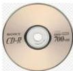
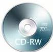

INKORANYAMUGA YIKORANABUHANGA

Imbikamakuru nzibacyuho (imbikamakuru nzibacyuho). HI: Imbikamakuru shusho (imbikamakuru shusho). Eng: Virtual Memory. Fr: Mémoire virtuelle. NK: Ikoranabuhanga rya mudasobwa. SH: Uburyo bwo gucunga ububiko bwa mudasobwa butuma mudasobwa ikoresha igice cy'ububiko bwo kuri disiki (Hard Disk cyangwa SSD) nk'aho ari RAM, bityo ikabasha gukoresha porogaramu nini cyangwa nyinshi icyarimwe.

Imbikamakuru ruziga (imbikamakuru ruziga). Eng: Compact Disc Recordable (CD-R). Fr: Disque compact enregistrable. NK: Urusobe ntangamakuru SH: Ubwoko bw'igikoresho koranabuhanga kibika amakuru (umuziki, videwo, inyandiko n'inkoranabuhanga) kigasomeshwa umuraba, kigashoboza abagikoresha kwandikaho amakuru inshuro imwe gusa, ariko ukaba wayasoma inshuro nyinshi, kikaba kidasibwa cyangwa ngo gihindurwe.

Imbikamakuru ruziga mpindurwa (imbikamakuru ruziga mpiindurwa). Eng: Compact Disc Re-Writable (CD-RW). Fr: Disque compact réinscriptible (CD-RW). NK: Urusobe ntangamakuru. SH: Sede itarandikwaho na rimwe ishobora kwandikwaho n'inshushanyamakuru kuri sede, ikaba yahanagurwa, ikongera ikandikwaho andi makuru inshuro nyinshi, bikorohereza abayikoresha guhindura amakuru igihe babishakiye.

Imbikamakuru ruziga nsomwa (imbikamakuru ruziga nsomwa). HI: Insomwa (insomwa). Eng: Compact Disc Read-Only Memory (CD-ROM). Fr: Mémoire morte sur disque compact (CD-ROM). NK: Urusobe ntangamakuru SH: Sede isomwa na mudasobwa ifite insomakuru nyamboni, ikaba ishobora gusomwa gusa, ntihindurwa cyangwa ngo ihanagurwe, bigatuma bayita imbikamakuru "yapfuye" kuko amakuru ariho ahoraho ntahinduke, umumaro wayo akaba ari ugasangiza ababikeneye inkoranabuhanga, amafishiye y'amakuru, n'ariho indirimbo n'amashusho.

Imbikarutonde koranabuhanga rw'amakuru y'ubuvuzi (imbikarutoonde koranabuhaanga rw'amakuru y'ubuvuuzi). HI: Imbikamakuru y'ubuvuzi koranabuhanga (imbikamakuru y'ubuvuuzi koranabuhaanga). Eng: Electronic Medical Record (EMR). Fr: Dossier Médical électronique. NK: Ikoranabuhanga rya mudasobwa. SH: