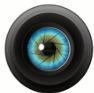

INKORANYAMUGA YIKORANABUHANGA

ukoresha ikoranabuhanga ubyemerewe kuba yakwinjira muri izo serivisi.

**Imbonezashusho** (imbonezashusho). Eng: Video adapter; graphics adapter; display adapter; graphics card; video card. Fr: **Adapterur video**; carte graphique, carte graphique, carte graphique; carte vidéo. NK: **Ikoranabuhanga rya mudasobwa**. SH: Kimwe mu bigize mudasobwa gishinzwe gutanga no kugaragaza amashusho ku nsakazamashusho.

**Imboni koranabuhanga** (imboni kōranabuhaanga). Eng: Lens. Fr: Objectif. NK: **Ikoranabuhanga ry'amashusho**. SH: Igice cya kamera gikora nk'ijisho kigatuma ifoto cyangwa amashusho bifatwa neza.

**Amakuru** (amakuru). Eng: Data; Digital content. Fr: Données; Contenu digital. NK: **Ikoranabuhanga rya mudasobwa**. SH: Ibishobora gusesengurwa na mudasobwa usanga ari nk'ibikorwa, imibare, ibipimo, ibyitonderwa cyangwa se ibisobanuro.

**Amakuru ngendanwa** (amakuru ngeendānwa). HI: **Ihuzanzira ry'amayinite** (ihuuzanzira ry'āmayinite). Eng: Mobile data; Cellular data. Fr: **Donnée mobile**. NK: **Itumanaho koranabuhanga**. SH: Amakuru yoherezwa cyangwa yakirwa atangiwe kuri telefoni ku buryo bw'inziramugozi telefoni idahujwe na WI-FI ahubwo ikoresheje amayinite yaguzwe.

**Amakuru ateguriwe ubwenge buhangano** (amakuru ateguuriwe ubwenge buhaangano). Eng: AI-ready data. Fr: **Données prêtes pour l'IA**. NK: **Ubwenge buhangano**. SH: Amakuru yakusanyijwe neza, agasukurwa, agashyirwaho ibisobanuro (labels), kandi agatunganywa mu miterere ikwiriye ku buryo ashobora gukoreshwa byoroshye mu gutoza, kugerageza no gukoresha porogaramu z'ubwenge bw'ubukorano (AI).

**Imenyasura** (imēnyasūura). HI: **Ibonasura** (ibōnasūura). Eng: Visual recognition; image recognition. Fr: **Reconnaissance visuelle**; reconnaissance d'images. NK: **Ikoranabuhanga rya mudasobwa**. SH: Imikorere nyabwemge aho umuntu amenya kandi agashyira mu byiciro ibintu, amasura, cyangwa ibiba bibaye biciye mu gufindura amakuru nyamboni y'aho ari aboneka mu mafoto n'amashusho, ni kimwe no guha

80