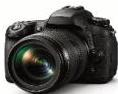
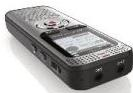

INKORANYAMUGA Y'IKORANABUHANGA

mudasobwa amadarubindi agezweho atuma ibona ikanasobanukirwa iyi si dutuyemo, bigasaba gushobora gutahura ikintu, kuba warigeze kukibona, kugihuza n'amakuru aranga icyo kintu abitse mu mbikamakuru no gushobora kugera mu kigega mbikamakuru no gukurayo amakuru yizewe.

**Imeri menyesha** (imēeri menyeesha). Eng: E-mail Alert. Fr: Alerte par courrier électronique. NK: Itumanaho koranabuhanga. SH: Uburyo bwo kumenyesha abakiriya amakuru ajyanye n’amakonti yabo hifashishijwe imeri.

**Imfasha** (imfashâ). Eng: Wizard. Fr: Assistant. NK: Ikoranabuhanga rya mudasobwa. SH: Igice cya porogaramu kikuyobora mu ntambwe zimwe na zimwe.

**Imfashajwi** (imfâshajwî). Eng: Voice assistant. Fr: Assistant vocal. NK: Ubwenge buhangano. SH: Uburyo bugufasha kuganira n’ubwenge buhangano ukoresheje ururimi uvuga.

**Imfatafoto** (imfatafoto). Eng: Camera. Fr: Appareil photo. NK: Ikoranabuhanga ry’amashusho. SH: Igikoresho gifata urumuri kikaruhinduramo ishusho, gikoresheje impitisharumuri irwegeranya ku buso mpunahunarumuri ahakorerwa ishusho (pelikile cyangwa imfatamakuru gitoroniki).

**Imfatafoto ya dijitale** (imfatafoto). Eng: DSLR Digital Camera. Fr: Appareil photo numérique. NK: Ikoranabuhanga ry’amashusho. SH: Igikoresho gifata kikanabika amashusho mu buryo koranabuhanga, hakoreshejwe imfatamakuru mu guhindura urumuri mo imiraba gitoroniki na yo isesengurwa kugira ngo itange ishusho koranabuhanga

**Imfatajwi** (imfâtajwi). Eng: Sound Recorder. Fr: Enregistreur de sons; magnétophone. NK: Ikoranabuhanga ry’amajwi. SH: Igikoresho kibika amajwi ku kidongi cy’umugozi mbikamajwi, yaba yoherejwe n’amikoro cyangwa avuye ku yindi mbikamajwi.

