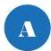

INKORANYAMUGA YIKORANABUHANGA

# INKORANYAMUGA YIKORANABUHANGA

Abafatanyabikorwa bifashisha urubuga (abafātanyabīkorwā biifāshiisha urubūga). Eng: Website affiliate; affiliate. Fra: Affilié du site Web; affilié du site de la toile; affilié. NK: Ikoranabuhanga rya mudasobwa. SH: Umufatanyabikorwa utangaza umurongo uhuza abasura urubuga rwe, abasomyi b'urubuga rwe, cyangwa urubuga rwe nkoranyambaga.

Abagarutse kuri murandasi (abagāruka kurī murāandasi). Eng: Returning visitors. Fr: Visiteurs qui reviennent. NK: Ikoranabuhanga rya murandasi. SH: Abashyitsi basuye urubuga rwa murandasi, bakaba barugarutseho.

Abashya kuri murandasi (abashyā kurī murāandasi). Eng: New Visitors; New Users. Fr: Nouveaux visiteurs. NK: Ikoranabuhanga rya murandasi. SH: Abasuye urubuga rwa murandasi bwa mbere.

Aderesi (adereēsi). Eng: Address. Fr: Addresse. NK: Ikoranabuhanga rya mudasobwa. SH: Ingenamikorere cyangwa urufunguzo rwihariye ruranga ahantu habitswe amakuru yihariye mu mbikamakuru ya mudasobwa cyangwa y'ihuzanzira nyamibare, yifashisha inzungano n'inkoranabuhanga bishobora gutahura, kubona cyangwa kugarura amakuru ku buryo buhamye.

Aderesi ndangarubuga (adereēsi ndāangarūbuga). HI: Indangarubuga ya murandasi, (indāangarūbuga ya mūraandasi). Eng: Web Address, Uniform Resource Locator (URL). Fr: Adresse web. NK: Ikoranabuhanga rya murandasi. SH: Ikiranga gikoreshwa mu gushakisha ikintu kiri kuri murandasi nk'urubuga, ifoto, cyangwa videwo.

Aderesi nyunganizi (adereēsi nyungaanizi). Eng: Subnet address. Fr: Adresse de sous-réseau. NK: Ikoranabuhanga rya murandasi. SH: Igice cy'umubare ndanga wa mudasobwa cyangwa w'igikoresho cy'ihuzanzira cyerekana agace k'ihuzanzira kiri hamwe n'irindi huzanzira ryagutse.