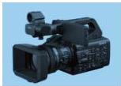
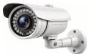

INKORANYAMUGA YIKORANABUHANGA

**Imfatamakuru** (imfātamākurū). Eng: Encoder. Fr: Encodeur. NK: Ikoranabuhanga rya mudasobwa. SH: igikoresho gihindura amakuru nyabubiri kikayashyira mu buryo bumwe bugezweho.

**Imfatashusho** (imfatashusho). HI: Kamera (kamera). Eng: Camera; video camera. Fr: Caméra; caméra vidéo. NK: Ikoranabuhanga ry'amashusho. SH: Igikoresho cya eregitoroniki gikurura cyane urumuri bigatuma gifata amashusho kikayagenera amafishiye

koranabuhanga kandi bigakorwa ku buryo bw’amashusho.

**Imfatashusho ngenzuzi** (imfatashusho ngeenzuuzi). Eng: Closed circuit television (CCTV). Fr: Télévision en circuit fermé. NK: Ikoranabuhanga rya mudasobwa. SH: Igikoresho gikora nka kamera, gifata amashusho y’abantu

ahantu hamwe na hamwe rusange nko mu nyubako, mu mijyi rwagati, ku mihanda, ku bibuga by’indege no mu binyabiziga bitwara abantu muri rusange, mu rwego rwo kugenzura ibikorerwamo.

**Imfatashusho ya mudasobwa** (imfatashusho ya mūdasobwā). HI: Kamera ya mudasobwa (Kamera ya mūdasobwā). Eng: Computer camera; webcam; web camera. Fr: Webcam; caméra vidéo; camera. NK: Ikoranabuhanga rya mudasobwa. SH: Igikoresho cyakorewe gufata

no gusakaza amashusho kuri mudasobwa cyangwa ku ihuzanzira koranabuhanga, kigakoreshwa ku buryo bw’imvugisho nyamashusho, igaragazamashusho rifatiyeho, imbuga nkoranyambaga no mu ikoranabuhanga.

**Imibare ifite ibice** (imibarē ifite ibicē). Eng: Floating point number. Fr: Nombre à virgule flottante. NK: Ikoranabuhanga rya mudasobwa. SH: Ubwoko bw’umubare ukoreshwa muri porogaramu za mudasobwa kugira ngo ugaragaze imibare nyayo ifite ubuziranenge bwo hejuru.

**Imibare y’ibice** (imibarē y’ibicē). Eng: Floating value; floating point number. Fr: Valeur de place flottante; nombre à point flottant. NK: Ikoranabuhanga rya mudasobwa. SH: Ubwoko bw’umubare ukoreshwa

82