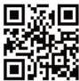

INKORANYAMUGA YIKORANABUHANGA

kimwe kikajya mu kindi, ariko ikintu nyirizina kigakomeza kuba cyo, hahinduka gusa imiterere cyangwa uko gikoreshwa.

**Impinyuza** (impinyūza). Eng: Boolean. Fr: Booléen. NK: Ikoranabuhanga rya mudasobwa. SH: Ibonezabitekerezo rikoreshwa na za mudasobwa mu gutahura niba icyemejwe ari ukuri cyangwa ari ikosa, ni ubwoko rero bw’amakuru bufite gusa agaciro gashoboka k’ubwoko bubiri gusa: ni byo cyangwa ni ikosa, akaba ari inshoza remezo y’ibonezamikorere n’iy’ibonezabitekerezo, bikaba ari iremezo ryifatabyemezo n’igenzura ry’ingano y’amakuru mu rwungano.

**Impishabanga shusho** (impishabaanga shusho). HI: Kode QR (Koode QR). Eng: Quick Response code (QR); QR code; QR. Fr: Code de réponse rapide; Code QR. NK: Ikoranabuhanga rya mudasobwa. SH: Ishusho ishobora gusomwa na mudasobwa cyangwa imfatashusho ya telefoni, muri uko kuyisoma ibasha kubona amakuru runaka ikeneye kandi byihuse.

**Impishamakuru** (impīshamākurū). Eng: Cryptographic token. Fr: Jeton cryptographique. NK: Inkoranabuhanga rya mudasobwa. SH: Urwungano rufatika kandi ngendanwa, rugenzurwa n’ukoresha mudasobwa hagamijwe kubika amakuru ahishe cyangwa nyamibare kandi akaba yakora imirimo nyamibare, imirimo banga.

**Impunikamakuru** (impūnikamākurū). HI: Ihuriro ry’amakuru (ihūuriro ry’amakurū). Eng: Data center. Fr: Centre de données. NK: Ikoranabuhanga rya mudasobwa. SH: Ahantu hafatika habitse za mudasobwa n’ibikoresho bijyana.

**Impuririzi** (impūririzi). Eng: Sensor. Fr: Capteur. NK: Ikoranabuhanga rya mudasobwa. SH: Igikoresho gifata amakuru y’ibiba cyangwa bihindutse aho kiri kikayohereza ibindi bikoresho gitoroniki akenshi aba ari inshobozamudasobwa, kigapima imiterere yihariye, kikohereza umuraba uba atari koranabuhanga ugomba guhindurwamo amakuru nyamibare kugira ngo mudasobwa ishobore kuwusoma, bikaba hifashishijwe impinduramakuru koranabuhanga.

89