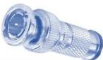

INKORANYAMUGA Y'IKORANABUHANGA

Impuzambuga (impūuzambūga). Eng: Web ring; Webring. Fr: Anneau Web. NK: Ikoranabuhanga rya murandasi. SH: Itsinda ry'imbuga za interineti zihuza zifite insanganyamatsiko imwe cyangwa inyungu imwe.

Impuzamiyoboro (impuuzamiyoboro). Eng: Connecting device. Fr: Dispositif de connexion; Périphérique de connexion. NK: Ikoranabuhanga rya murandasi. SH: Igikoresho gihuza ibitangazamakuru hagati yabyo kigakora nk'impuza nkoranabuhanga hagati y'ihuzanzira zitandukanye cyangwa za mudasobwa.

Impuzandengo ndangabara (impūuzandēengo ndāangabāra). Eng: Mean color descriptor. Fr: Descripteur de couleur moyen. NK: Ikoranabuhanga rya mudasobwa. SH: Uburyo bworoshye kandi bufite akamaro ko kwerekana imiterere y'amabara yose y'ishusho

Impuzanzira (impuuzanzira). HI: Impuuza (impuūza). Eng: Link. Fr: Lien. NK: Ikoranabuhanga rya murandasi. SH: Urwinjiriro rwo kuri murandasi rutanga inzira ikugeza ku handi hantu havomwa amakuru nko ku rubuga rwa murandasi, ku nyandiko cyangwa ku ifishiye,..., rukarangwa no kuranga neza aderesi y'ahafunguwe cyangwa ahagiwe.

Impuzawindowuzi (impūuzawiindowuzi). Eng: Windows socket; Winsock. Fr: Socket Windows. NK: Ikoranabuhanga rya mudasobwa. SH: Dosiye zemerera porogaramu za Windows guhuza na interineti n'izindi mudasobwa.

Impuzo ikorewemo (impūuzo ikōrewemō). Eng: Object Linking and Embedding (OLE). Fr: Liaison et intégration d'objets. NK: Ikoranabuhanga rya mudasobwa. SH: Uburyo bw'ikoranabuhanga bwakozwe na Mikorosofti bugufasha gufata ibintu biri mu nyandiko cyangwa mu kinyabugeni kimwe byakorewemo, ukabishyira mu kindi kinyabugeni cyangwa porogaramu.

Impuzo ndatenguha (impūuzo ndateengūha). Eng: Bayonet Neill-Concelman Connector; BNC connector. Fr: Connecteur BNC. NK: Ikoranabuhanga rya murandasi. SH: Icyuma kiburungushuye kikagira umuringa urimo imbere giherereye ku mpera y'urusinga kikifashishwa mu kurucomeka ku urundi rusinga.

